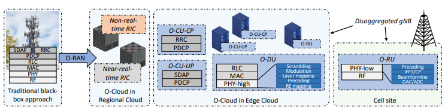
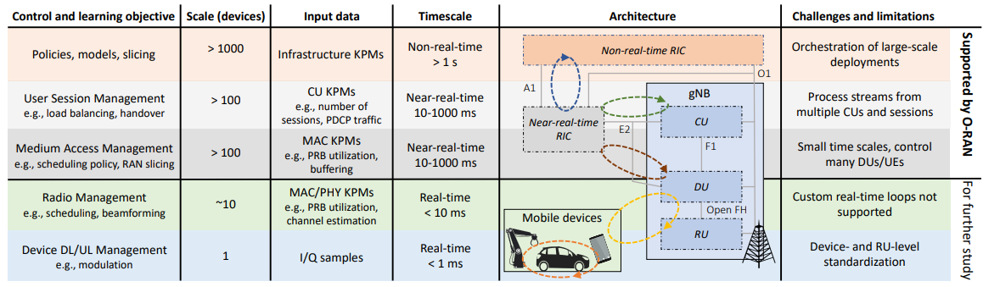
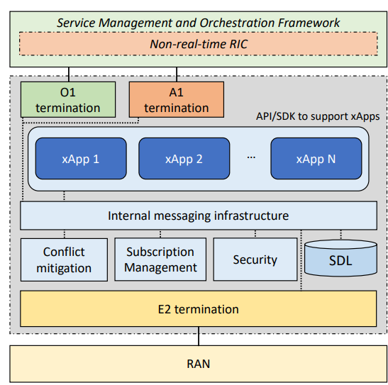
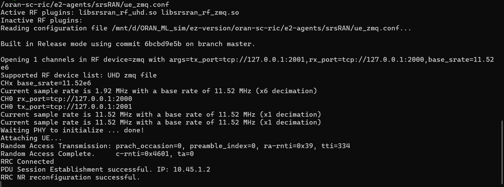
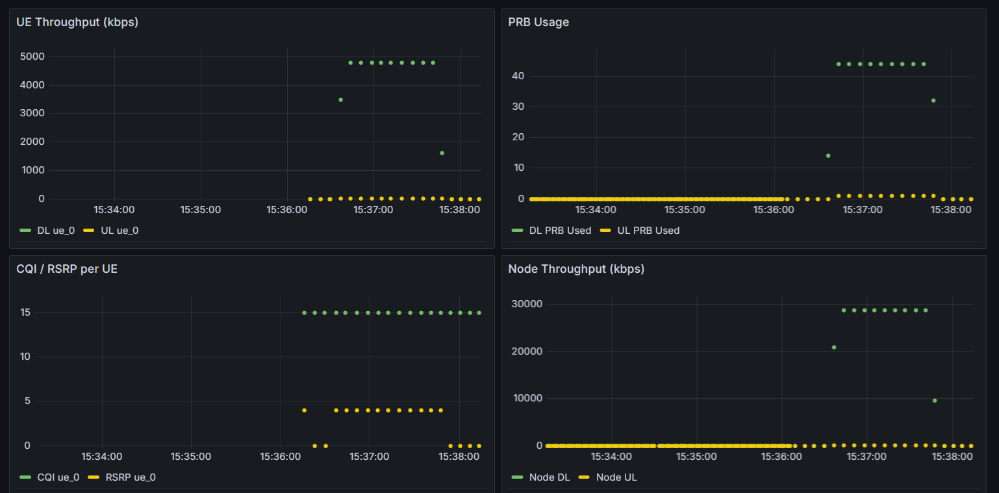
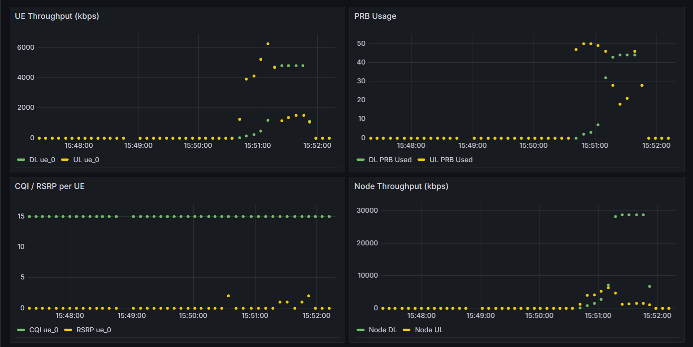
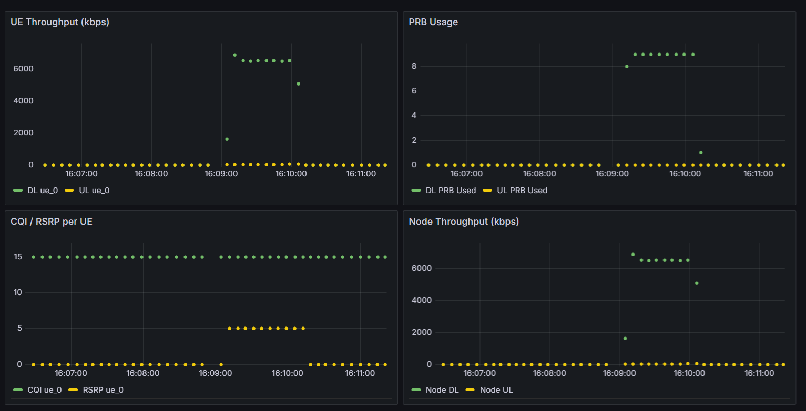
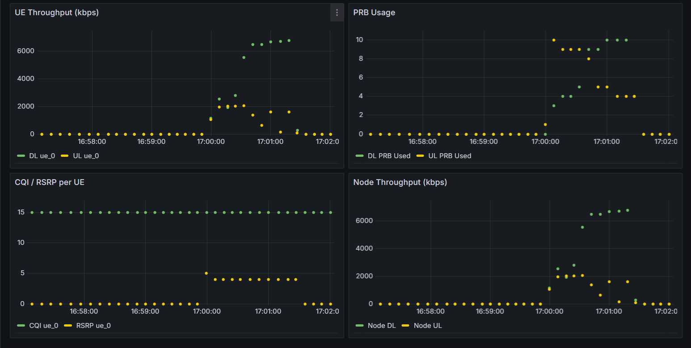

# ORAN FUNDAMENTAL

Fundamental - Opensource - Setup - Implementation - Result

#### Fundamental

O-RAN is deployed on top of 3GPP. 3GPP is the standard for mobile communication architecture, consisting of 3 main parts: RU, DU, and CU, where

- RU is responsible for:
    - RF: handling radio frequency components
    - PHY: precoding, FFT, Cyclic Prefix, Beamforming
- DU is responsible for:
    - MAC: physical resource block mapping, scheduling, and retransmission on packet errors (HARQ)
    - RLC: segmentation, reassembly, ARQ retransmission, and tracking per-packet delay
- CU is responsible for:
    - RRC: establishing the connection between UE and gNB, configuring PDCP/RLC/MAC parameters, deciding handovers, managing mobility and measurement reports
    - PDCP: compressing IP/TCP headers, encrypting data, reordering packets, and deduplication
    - SDAP: mapping IP flows to QoS flows, determining which network slice a user's traffic belongs to



Traditionally, all of these functions are compressed into a black box that only the vendor controls. In O-RAN, that is no longer the case — it introduces an open programmable layer called the RIC (RAN Intelligent Controller), where logic is deployed as xApps (near-RT control, 10 ms – 1 s loop) and rApps (non-RT control, > 1 s loop).



#### Near-RT RIC

The Near-RT RIC operates on a control loop of **10 ms – 1 s**. It sits between the gNB and the non-RT RIC and is responsible for fine-grained, fast decisions like:

- Adjusting PRB (Physical Resource Block) quotas per slice in real time
- Triggering handovers based on live UE measurements
- Dynamic QoS policy enforcement per UE

It connects to the gNB via the **E2 interface** — a standardized O-RAN interface that carries two types of traffic:

- **E2AP** (Application Protocol): the wire-level framing, handles setup, subscription, indication, and control messages
- **E2SM** (Service Model): defines the *content* inside those messages — what metrics to report (KPM), what control actions to apply (RC), what policies to push (CCC)

The gNB side of this connection is called the **E2 Agent** — a built-in component of the gNB that speaks E2AP/E2SM and exposes its internal state (scheduler metrics, UE measurements) to the RIC. Think of the E2 Agent as the gNB's API server, and the Near-RT RIC as the client calling it.

xApps on the Near-RT RIC subscribe to data streams from the E2 Agent and send control commands back — all within sub-second latency.

#### Non-RT RIC

The Non-RT RIC operates on a control loop of **> 1 s** (typically seconds to minutes). It lives inside the **Service Management and Orchestration (SMO)** layer, above the Near-RT RIC, and handles slower, higher-level decisions:

- Training and updating ML models based on historical data
- Pushing trained policies or configuration down to the Near-RT RIC
- Long-term network optimization (capacity planning, energy saving)


## Architecture



The image above shows the full O-RAN architecture. Reading top to bottom:

**SMO / Non-RT RIC** sits at the top. It manages the whole system — provisioning, configuration, and ML model training. It talks down to the Near-RT RIC via **A1** (policy intent) and to all network functions via **O1** (NETCONF/YANG configuration and fault management).

**Near-RT RIC** sits in the middle. It hosts xApps and connects to the gNB via **E2** (metrics + control). It receives high-level policy from the SMO above and applies fine-grained control below.

**O-CU-CP / O-CU-UP** is the CU split into control plane and user plane. CU-CP handles RRC and NGAP toward the 5G Core. CU-UP handles SDAP and PDCP for user data. They connect to the DU via **F1-C** and **F1-U** respectively.

**O-DU** runs MAC and RLC. It connects to the CU above via F1 and to the RU below via the **Open Fronthaul (eCPRI)** interface — the key interface that replaces the old proprietary CPRI link.

**O-RU** is the radio hardware at the cell site. It handles PHY (lower layers) and RF. Everything above it can run on commodity servers anywhere in the network.

**UE** connects to the O-RU over the air (NR Uu interface). In simulation this is replaced by ZMQ.

The interfaces that make O-RAN "open":

| Interface | Between | Purpose |
|---|---|---|
| A1 | Non-RT RIC → Near-RT RIC | Policy guidance |
| E2 | Near-RT RIC ↔ gNB | Metrics (KPM) + Control (RC, CCC) |
| O1 | SMO → all network functions | Configuration, fault, performance management |
| F1-C / F1-U | CU ↔ DU | Control plane / user plane split |
| Open Fronthaul | DU ↔ RU | Replaces proprietary CPRI with open eCPRI |
| Xn | gNB ↔ gNB | Inter-gNB handover coordination |
| NGAP | gNB → AMF (5GC) | UE registration, session management |

## Setup

#### 1. Configure IPs and versions

All service IPs and versions are defined in `oran-sc-ric/.env`. Edit this file before starting anything:

```env
# RIC platform network
RIC_SUBNET=10.0.2.0/24

# Each service gets a fixed IP on ric_network
E2TERM_IP=10.0.2.10       # E2 termination — gNB connects here (SCTP :36421)
E2MGR_IP=10.0.2.11        # E2 manager
DBAAS_IP=10.0.2.12        # Redis SDL
SUBMGR_IP=10.0.2.13       # Subscription manager
APPMGR_IP=10.0.2.14       # xApp manager
RTMGR_SIM_IP=10.0.2.15   # Routing manager
XAPP_PY_RUNNER_IP=10.0.2.20
SLICE_CTRL_XAPP_IP=10.0.2.21
```

The gNB config (`e2-agents/srsRAN/gnb_zmq.yaml`) must point to `E2TERM_IP:36421` — if you change the IP here, update it there too.

#### 2. Start RIC services (in dependency order)

Docker Compose handles the order automatically, but understanding the dependency chain matters when debugging:

```
dbaas (Redis)         — must be up first, everything reads/writes state here
    ↓
rtmgr_sim             — loads routing table, must be ready before RMR messages flow
    ↓
e2term                — opens SCTP :36421, waits for gNB to connect
e2mgr                 — registers E2 nodes into dbaas
submgr                — manages subscriptions, depends on e2mgr + dbaas
appmgr                — deploys xApps, depends on submgr
    ↓
5gc (open5gs)         — 5G Core, gNB needs this before it can serve UEs
    ↓
xApps                 — start last, after RIC platform and gNB are ready
```

Start everything with one command:

```bash
cd oran-sc-ric
docker compose up --build -d
```

Verify all containers are healthy:

```bash
docker compose ps
```

#### 3. Build and start the gNB

The gNB runs as a **Docker container** (not on the host) so it can reach both the RIC network and the RAN network directly. It is built from source inside the container using `srsRAN_Project/`.

```bash
cd oran-sc-ric
docker compose build gnb
docker compose up -d gnb
```

Once running, the gNB container will:
- Connect to 5GC (AMF) at `10.53.1.2:38412` over NGAP — same Docker network
- Connect to RIC (e2term) at `10.0.2.10:36421` over SCTP — same Docker network
- Open ZMQ on `tcp://0.0.0.0:2000`, reachable from host via `host.docker.internal`

#### 4. Build and start srsUE

srsUE runs **natively on the host** (not in Docker) because it needs a TUN interface for real IP traffic.

```bash
# Build (first time only)
cd srsRAN_4G && mkdir -p build && cd build
cmake .. -DENABLE_ZEROMQ=ON
make -j$(nproc) srsue

# Create network namespace before running — srsUE expects it to already exist
sudo ip netns add ue1

# Run
sudo srsRAN_4G/build/srsue/src/srsue \
  oran-sc-ric/e2-agents/srsRAN/ue_zmq.conf
```


## Data Flow

#### E2 Setup — gNB registers with the RIC

When the gNB starts it initiates the E2 connection:

```
gNB E2 Agent                e2term              e2mgr              dbaas
     │                         │                   │                  │
     │── SCTP connect ─────────►│                   │                  │
     │── E2 Setup Request ──────►│                   │                  │
     │                         │── RMR 12001 ───────►│                  │
     │                         │                   │── store node ────►│
     │                         │                   │   (ID, IPs,       │
     │                         │                   │   RAN functions)  │
     │                         │◄── RMR 12002 ──────│                  │
     │◄── E2 Setup Response ────│                   │                  │
```

After this, e2mgr knows the gNB exists, its node ID, and which E2 service models it supports (KPM, RC, CCC). All stored in Redis.

---

#### Subscription — xApp subscribes to KPM metrics

```
xApp                submgr                e2term            gNB E2 Agent
  │                    │                     │                    │
  │── REST POST ───────►│                     │                    │
  │  /subscribe        │── query e2mgr       │                    │
  │  (node, metrics,   │   (node exists?)    │                    │
  │   period=1000ms)   │                     │                    │
  │                    │── RMR 12010 ────────►│                    │
  │                    │                     │── E2 Sub Req ──────►│
  │                    │                     │◄── E2 Sub Resp ─────│
  │                    │◄── RMR 12011 ────────│                    │
  │◄── REST 200 OK ────│                     │                    │
  │   (subscription ID)│                     │                    │
```

From this point the gNB starts sending KPM indications every 1000 ms.

---

#### Indication — gNB pushes KPM metrics to xApp

```
gNB E2 Agent          e2term                    xApp (all subscribers)
     │                   │                              │
     │── KPM Indication ─►│                              │
     │   (ASN.1 encoded)  │── RMR 12050 ────────────────►│ (port 4560)
     │                   │── RMR 12050 ────────────────────►│ (port 4561)
     │                   │── RMR 12050 ──────────────────────►│ (port 4562)
     │                   │                              │
     │                   │              xApp decodes, writes to InfluxDB
```

e2term broadcasts to every port registered for type `12050` in the routing table — multiple xApps receive the same stream simultaneously.

---

#### Control — xApp pushes PRB quota to gNB scheduler

```
xApp              e2term              gNB E2 Agent        MAC Scheduler
  │                  │                     │                    │
  │── RMR 12040 ────►│                     │                    │
  │  (E2SM-RC:       │── E2 Control Req ──►│                    │
  │   PRB quota      │                     │── apply quota ────►│
  │   SST1=60%       │                     │                    │── enforce on
  │   SST2=30%       │                     │                    │   next slot
  │   SST3=10%)      │                     │                    │
  │                  │◄── E2 Control Ack ──│                    │
  │◄── RMR 12041 ────│                     │                    │
```

The MAC scheduler applies the new PRB ratios immediately — effect is visible in the next KPM indication as updated `RRU.PrbUsedDl/Ul` metrics.

---

#### KPM Metric — full data path from radio to Grafana

Where each metric physically comes from inside the gNB, and how it travels to the dashboard:

```
UE (radio)
  │  ZMQ IQ samples
  ▼
PHY layer — measures signal quality per UE
  │  CQI (Channel Quality Indicator)
  │  RSRP (Reference Signal Received Power)
  ▼
MAC scheduler — measures resource usage per slot
  │  RRU.PrbUsedDl / RRU.PrbUsedUl  (PRB utilization)
  │  RACH attempts, HARQ stats
  ▼
RLC layer — measures per-packet delay and volume
  │  RLC.BufferDelay
  │  RLC SDU volume DL/UL
  ▼
CU-UP (PDCP) — measures end-to-end throughput per DRB
  │  DRB.UEThpDl / DRB.UEThpUl
  ▼
E2 Agent (DU side, enabled in gnb_zmq.yaml)
  │  collects all above every 1000 ms
  │  encodes into E2SM-KPM Indication (ASN.1)
  ▼
e2term → RMR 12050 → kpm_dashboard_xapp
  │  decodes ASN.1
  │  tags: gnb=<node_id>, ue=<rnti>
  ▼
InfluxDB (time-series DB)
  ▼
Grafana → http://localhost:3000
```

Note from `gnb_zmq.yaml` — only the DU E2 agent is enabled (`enable_du_e2: true`), so metrics come from the DU layers (MAC, RLC, PHY). CU-CP and CU-UP E2 agents are disabled (`enable_cu_cp_e2: false`, `enable_cu_up_e2: false`), meaning PDCP-level throughput metrics route through the DU report as well.

---

#### UE Setup

The UE is configured in `oran-sc-ric/e2-agents/srsRAN/ue_zmq.conf`. Key parameters to understand:

**RF — ZMQ transport replacing real radio**
```ini
device_name = zmq
device_args = tx_port=tcp://127.0.0.1:2001,rx_port=tcp://127.0.0.1:2000,base_srate=11.52e6
```
- UE transmits to `127.0.0.1:2001` → received by gNB container RX
- UE receives from `127.0.0.1:2000` → sent by gNB container TX
- Sample rate `11.52 MHz` matches a 10 MHz NR cell (must match gNB)

**USIM — SIM card identity**
```ini
algo = milenage          # authentication algorithm
imsi = 001010123456780   # must be pre-provisioned in open5gs
k    = 00112233445566778899aabbccddeeff   # secret key
opc  = 63BFA50EE6523365FF14C1F45F88737D  # operator key
```
These must match exactly what is stored in the 5GC subscriber database. If IMSI or keys mismatch, authentication fails and the UE never attaches.

**NAS — network access**
```ini
apn = srsapn      # APN must match open5gs session config
apn_protocol = ipv4
```

**Network interface**
```ini
netns = ue1           # Linux network namespace for the UE
ip_devname = tun_srsue   # TUN interface name, gets IP 10.45.1.2
```
Traffic sent to `tun_srsue` goes through the full 5G stack — gNB → 5GC → internet.

**Radio band — must match gNB cell config**
```ini
[rat.nr]
bands = 3          # NR Band 3 (1800 MHz), matches dl_arfcn: 368500 in gnb_zmq.yaml
nof_carriers = 1
```

**Run**

```bash
# Build (first time only)
cd srsRAN_4G && mkdir -p build && cd build
cmake .. -DENABLE_ZEROMQ=ON
make -j$(nproc) srsue

# Start UE — must run after gNB container is up and ZMQ ports are open
sudo srsRAN_4G/build/srsue/src/srsue \
  oran-sc-ric/e2-agents/srsRAN/ue_zmq.conf
```

**Result:**
After sucessfully connected, this is the expected output. 



**Test traffic**

UE IP: `10.45.1.2` (on `tun_srsue`). UPF gateway: `10.45.1.1` (inside `open5gs_5gc` container).

**Downlink (core → UE):**
```bash
# Terminal 1: start iperf3 server inside UE namespace
sudo ip netns exec ue1 iperf3 -s

# Terminal 2: send downlink from open5gs container
docker exec -it open5gs_5gc iperf3 -c 10.45.1.2 -b 1M -t 30
```

**Uplink (UE → core):**
```bash
# Terminal 1: start iperf3 server inside open5gs container
docker exec -it open5gs_5gc iperf3 -s

# Terminal 2: UE sends uplink traffic
sudo ip netns exec ue1 iperf3 -c 10.45.1.1 -b 1M -t 30
```

To trigger **eMBB** (DL-heavy, ratio ≥ 5): run downlink at high bitrate and uplink at low bitrate.  
To trigger **URLLC** (symmetric): run both DL and UL at similar bitrates.  
To trigger **mMTC** (idle): stop iperf3 or keep total < 200 kbps.

#### Slice Classification and PRB Management

The `slice_ctrl_xapp` reads InfluxDB every 5 s, classifies the dominant traffic pattern, and sends the corresponding PRB quota to the MAC scheduler via E2SM-RC:

| Slice | SST | Traffic condition | PRB min | PRB max |
|---|---|---|---|---|
| eMBB | 1 | DL-heavy, DL/UL ratio ≥ 5 | 10% | 60% |
| URLLC | 2 | Symmetric, DL/UL ratio < 5 | 10% | 30% |
| mMTC | 3 | Total DL + UL < 200 kbps | 0% | 20% |

- **min PRB** — the guaranteed floor the scheduler always reserves for that slice, even when idle
- **max PRB** — the hard ceiling the slice can never exceed, regardless of demand

The caps are intentionally distinct so the demo clearly shows the scheduler enforcing different limits — SST1 gets the most headroom (60%), SST2 is constrained to 30%, and SST3 is capped at 20%. This makes the difference visible in Grafana when switching between traffic patterns.

**Result**:

Normally if sent without slice_ctrl_xapp service, it will use 100% of prb to implement that

Example: UE receive 50mbps data in 60s



Example: UE and server transmit 5mbps in 60s



And this is the result with slice_ctrl_xapp enable:

This is the first case when UE receive 50mbps UDP data 


This is the second case 



> **Restarting the simulation:** always do a full `compose down` before bringing everything back up, then recreate the namespace before running srsUE again:
> ```bash
> cd oran-sc-ric
> docker compose down
> docker compose up --build -d
> sudo ip netns delete ue1   # clean up old namespace
> sudo ip netns add ue1      # recreate fresh
> sudo srsRAN_4G/build/srsue/src/srsue oran-sc-ric/e2-agents/srsRAN/ue_zmq.conf
> ```